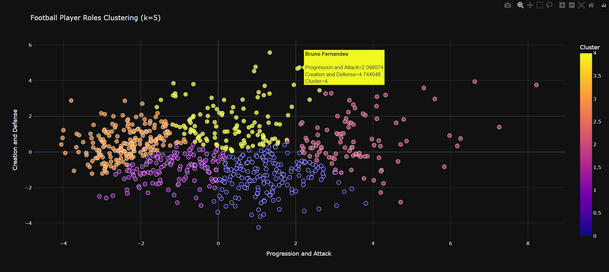

# Midfielders Clustering Project

This project focuses on clustering football midfielders based on their performance metrics and playing styles. Below is a summary of the clustering workflow and methodologies used:

## Data Preparation
- Collected player statistics from the Kaggle dataset in https://www.kaggle.com/datasets/hubertsidorowicz/football-players-stats-2024-2025.
- Cleaned and preprocessed the data (handled missing values, normalized features).
- Selected relevant features for clustering (e.g., passes, tackles, dribbles, progressive carries).

## Exploratory Data Analysis (EDA)
- Visualized distributions of key features.
- Analyzed correlations between variables.
- Used PCA (Principal Component Analysis) to reduce dimensionality and visualize player spread.

## Clustering Methods
- Applied K-Means clustering to group midfielders into distinct clusters.
- Used the Elbow Method to determine the optimal number of clusters.

## Cluster Analysis
- Interpreted each cluster by examining feature averages and player examples.
- Visualized clusters using scatter plots (PCA components, t-SNE).
- Profiled clusters to identify types (e.g., defensive, box-to-box, creative midfielders).

## Results
- Identified clear groups of midfielders with similar playing styles.
- Provided insights into player roles and potential transfer targets.
- Clusters made with k=5:
    - 0 -> **Progressive carriers**: Players who mostly focus on speed and movement with the ball (ex. Mohammed Kudus)
    - 1 -> **Box-to-Box**: Players with very balanced metrics, who can offer all across the pitch (ex. Andre Franck Zambo Anguissa)
    - 2 -> **Elite creators**: Players with high output in the final 3rd (no 10s/wingers) (ex. Florian Wirtz)
    - 3 -> **Defensive anchors**: Players mostly focused on winning the ball back and helping the defense (ex. Moises Caicedo)
    - 4 -> **Deep-Lying Playmakers**: Players who orchestrate the game from deep (ex. Pedri)

## Importance of analysis
The analysis of midfielder clusters is crucial for several reasons:
- **Player Recruitment:** Helps clubs identify players who fit specific tactical profiles or fill gaps in their squad.
- **Tactical Insights:** Provides coaches and analysts with a deeper understanding of player strengths and roles within different systems.
- **Player Development:** Assists in tracking player progress and identifying areas for improvement based on cluster characteristics.
- **Market Value Assessment:** Offers data-driven insights that can influence player valuation and transfer decisions.
- **Scouting Efficiency:** Streamlines the scouting process by highlighting players with similar attributes to successful profiles.

## Find Similar Players
The program allows you to input a player name and returns the most similar players based on clustering and feature similarity. Example usage:

```python
from midfielders_clustering import find_similar_players

similar_players = find_similar_players('Pedri')
print(similar_players)
```

- The function `find_similar_players` takes a player name as input.
- It locates the player's cluster and compares feature vectors to find the closest matches.
- The output is a list of players with similar playing styles and metrics.

## Visualization


## Tools & Libraries
- Python (pandas, numpy, scikit-learn, matplotlib, seaborn)

---

For more details, see the code and notebooks in this repository.